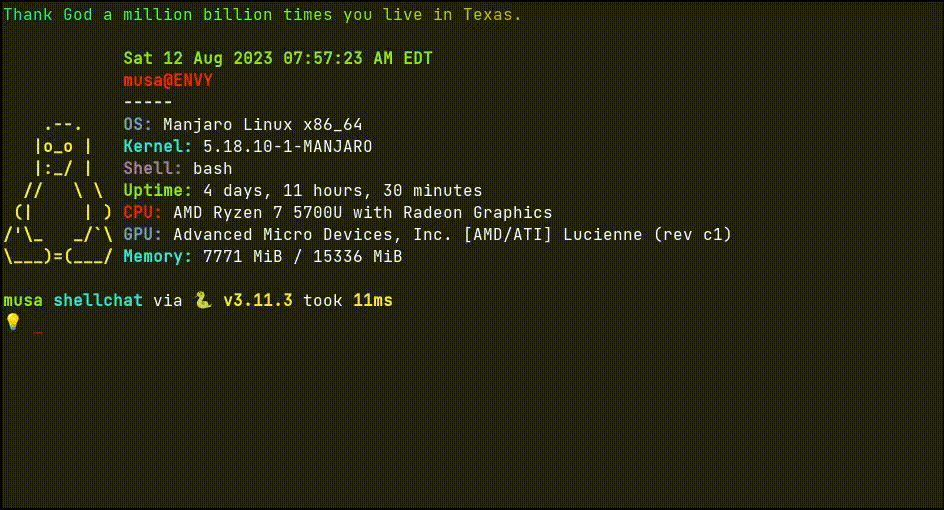

# 💬 ShellChat

  <br>
Create multiple stopwatchs with labels. You can find a live demo [here](<[https://m-gdev.github.io/ShortURL](https://label-watch.vercel.app/)>).

#### Table of Contents

-   [Demo](#demo)
-   [Why I Created this Project](#why-i-created-this-project)
-   [Technologies Used](#technologies-used)
-   [Features](#features)
-   [How to Run the Project](#how-to-run-the-project)
-   [Inspiration](#inspiration)
-   [Contact](#contact)
-   [License](#license)

## Demo



## Why I Created this Project

-   I wanted a fast way to use ChatGPT in the terminal

## Technologies Used

-   🐍 Python to help interface with OpenAI's api

## How to Run the Project

Clone the repository and then run the following commands in the directory:

```bash
pip install  openai
python3 main.py
```

Make sure you make your api key available in your local environment. Here's an easy way to do it:

```bash
OPENAI_API_KEY="xxxxxxxxxxxxxxxxxxxxxxxxx" python3 main.py
```

If you want a more permanent solution you can add this line to your `.bashrc`

```bash
export OPENAI_API_KEY="xxxxxxxxxxxxxxxxxxxxxxxx"
```

## Contact

Created by [Musa Ahmed](https://github.com/m-GDEV). Check out my website: <https://connectiwthmusa.com>

## License
This project is open source and available under the [MIT License](https://choosealicense.com/licenses/mit/).
